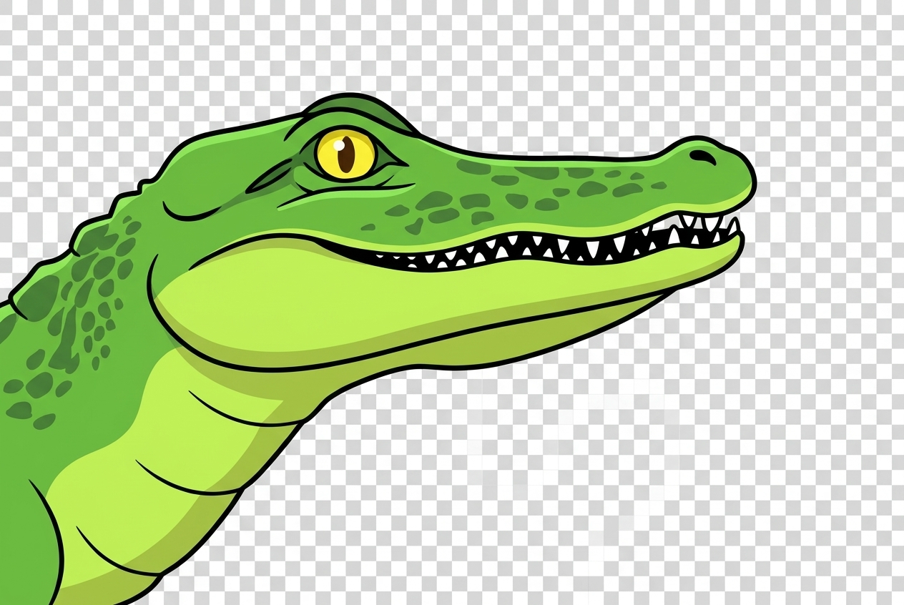

<p align="center">
  
</p>

# gator

A PTY-backed terminal emulator written in Rust, with a quiet alligator-inspired default palette. Ships two interchangeable backends behind a single `Renderer` trait:

- **GPU** (default): a native window via `winit` + `wgpu` with a `cosmic-text` glyph atlas and a single instanced quad pass per frame. HiDPI-aware.
- **TUI** (`--tui`): a terminal-in-a-terminal via `crossterm`, with dirty-cell `FrameDiff` rendering.

Both backends share the same parser, grid, scrollback, selection, mouse handling, and session logging.

## Quick start

```sh
cargo build
cargo run                 # GPU windowed terminal (default)
cargo run -- --tui        # crossterm fallback (runs inside your current terminal)
cargo run -- --config /path/to/config.toml
cargo test                # 63 unit tests
```

Requires a Rust toolchain that supports edition 2021. `Cargo.lock` is committed (this is a binary crate).

## Architecture

Designed so data flows downward: there is exactly one owner of each piece of state and no `Arc<Mutex>` / callback ladders. The orchestrator (`main.rs` for TUI, `app.rs` for GPU) holds `Grid` + `CursorState` + the vte `Parser`; everything else borrows.

| File | Role |
|---|---|
| `main.rs` | Arg parsing, config load, branches to GPU (default) or TUI orchestrator |
| `app.rs` | GPU app: winit event loop, mouse/keyboard handling, selection, clipboard, scroll |
| `ansi.rs` | `StateMutator` implements `vte::Perform` → Grid mutations and PTY query replies |
| `grid.rs` | `Cell` (16 B, `#[repr(C)]`), `Grid`, `CursorState`, `Selection`, `MouseMode`, scrollback ring, view offset |
| `gpu.rs` | wgpu 0.20 device/surface, R8 glyph atlas via cosmic-text, one instanced quad pipeline |
| `render.rs` | `Renderer` trait, `FrameDiff`, `CrosstermRenderer` (TUI) |
| `pty.rs` | `PtyBackend` trait + `PortablePty` (portable-pty) with `into_split()` read/control halves |
| `event.rs` | `TerminalEvent` enum + `MouseAction`/`MouseButton`/`Mods`/`ScrollCmd` |
| `mouse.rs` | SGR (`?1006`) and X10 mouse-event encoder, shared by both backends |
| `config.rs` | serde-deserialized `Config` + `~` / `{ts}` path expansion |
| `session.rs` | `SessionLogger` (raw + plain-text logs) and cross-session scrollback restore |

The crate is laid out in four conceptual phases, mirroring `spec.md`:

1. **PTY + event loop** (`pty.rs`, `event.rs`)
2. **ANSI parsing** (`ansi.rs`, using `vte` 0.13)
3. **Grid state + scrollback** (`grid.rs`)
4. **Rendering** (`render.rs`, `gpu.rs`)

## Configuration

Resolution order: `--config <path>` > `$XDG_CONFIG_HOME/gator/config.toml` > `~/.config/gator/config.toml`. If the new path is absent, Gator also checks the old `gaterminal` config path for compatibility. A missing file silently uses defaults; a present-but-invalid file is a hard error with the offending path.

`serde(deny_unknown_fields)` is set on every section: typos error out instead of being silently ignored.

### Full example

```toml
# ~/.config/gator/config.toml

# Override $SHELL. If absent, $SHELL is used, then /bin/sh.
shell = "/opt/homebrew/bin/fish"

# Scrollback ring buffer size, in lines.
scrollback = 50000

[font]
# Logical font size in points. HiDPI scaling is applied automatically.
size = 16.0
# Line height = size * line_height.
line_height = 1.25
# Optional explicit font file. Falls back to system monospace if unset.
path = "/System/Library/Fonts/Menlo.ttc"

[colors]
# `#rgb` or `#rrggbb`. These map the "default fg/bg" sentinels at render time
# (SGR reset / 39 / 49 produce them); no grid mutation needed.
foreground = "#dde6b8"
background = "#08110b"

[window]
# Initial logical (pre-DPI) size of the GPU window.
width  = 1280
height = 800

[chrome]
# Show the Gator icon in native window chrome where supported.
# macOS does not expose a stable per-window titlebar icon through winit.
titlebar_icon = true
# Flash the screen briefly on BEL.
visual_bell = true
# Padding (logical px) between the window edge and the cell grid.
padding = 0

[session]
# Raw byte-for-byte session log, one file per launch. Empty = off.
# `~` expands to $HOME. `{ts}` expands to unix seconds.
raw_log = "~/.local/share/gator/sessions/{ts}.raw"

# Plain-text scrollback log (append). Each line is written as it scrolls out
# of the viewport into scrollback. Trailing spaces are stripped. Empty = off.
text_log = "~/.local/share/gator/history.log"

# On startup, preload this many lines from `text_log` into the scrollback
# ring so PageUp shows yesterday's session. 0 = no restore.
# Requires `text_log` to be set.
restore_lines = 2000
```

### Defaults

| Key | Default |
|---|---|
| `shell` | `$SHELL`, else `/bin/sh` |
| `scrollback` | `10000` |
| `font.size` | `18.0` |
| `font.line_height` | `1.3` |
| `font.path` | unset (resolves via fontdb) |
| `colors.foreground` | `#dde6b8` |
| `colors.background` | `#08110b` |
| `window.width` / `window.height` | `960` / `600` |
| `chrome.titlebar_icon` | `true` |
| `chrome.visual_bell` | `true` |
| `chrome.padding` | `0` |
| `session.raw_log` | `""` (off) |
| `session.text_log` | `""` (off) |
| `session.restore_lines` | `0` |

### Path tokens

| Token | Expands to |
|---|---|
| `~` (leading) | `$HOME` |
| `{ts}` | seconds since UNIX epoch as an integer (used for raw-log filenames) |

## Keybindings

Bindings live in the GPU backend (`app.rs`) and the TUI input task (`main.rs`). They behave the same in both unless noted.

| Combo | Action |
|---|---|
| Ctrl+Shift+C / Cmd+C | Copy current selection to system clipboard |
| Shift+PageUp / PageDown | Scroll view by one page |
| Shift+ArrowUp / ArrowDown | Scroll view by one line |
| Shift+Home / End | Jump to top / bottom of scrollback |
| Mouse wheel | Scroll view (3 lines per click); passes through to apps that captured the mouse |
| Shift + mouse drag | Force native text selection even when an app has captured the mouse |
| Any text input | Snaps view back to bottom |

Selection notes (GPU only): left-button drag selects in reading order; release auto-copies non-empty selections. Selection coordinates are absolute, so they stay anchored across scrolling and across new lines arriving in scrollback. TUI selection rendering is intentionally deferred; mouse passthrough still works there.

## Backends

| | GPU (default) | TUI (`--tui`) |
|---|---|---|
| Renderer | `gpu::GpuRenderer` (winit + wgpu) | `render::CrosstermRenderer` |
| Text | cosmic-text glyph atlas | crossterm cells |
| Selection rendering | Yes (XOR fg/bg inversion) | No (deferred); passthrough still works |
| HiDPI | Yes (`ScaleFactorChanged` re-rasterizes) | N/A |
| Clipboard | `arboard` | N/A in this binary |
| Scrollback view | Yes | Yes (via `FrameDiff` over `display_row`) |
| Bracketed paste | Yes (`?2004` + winit paste) | Yes (`?2004` + crossterm paste) |

The crossterm path uses `cfg.shell` and `cfg.scrollback`; `font`, `colors`, and `window` are ignored (no GPU).

## ANSI / VT coverage

Implemented in `ansi.rs::csi_dispatch`, `execute`, and `esc_dispatch`:

- **CSI**: `m` (SGR incl. 16-color, 256-color, truecolor), `H` / `f`, `A` / `B` / `C` / `D`, `G` / `` ` ``, `d`, `J`, `K`, `P`, `@`, `X`, `r` (DECSTBM), `s` / `u`, `L` / `M`, `c` (DA1), `n` (DSR 5/6), `h` / `l` (private modes)
- **DEC private modes**: `?7` (DECAWM), `?25` (DECTCEM), `?47` / `?1047` / `?1049` (alt screen), `?1000` / `?1002` / `?1006` (mouse), `?2004` (bracketed paste)
- **ESC**: `7` / `8` (DECSC / DECRC), `M` (RI), `D` (IND), `E` (NEL)
- **C0**: `\n`, `\r`, `\b`, `\t`

## Testing

```sh
cargo test                                # all 39 tests
cargo test ansi::tests::selection         # filtered
cargo test --quiet
```

Test discipline established by the codebase:

- Parser/grid behavior is covered headlessly via a `drive(cols, rows, bytes)` helper that feeds the real vte parser through `StateMutator` against a `Grid`. See `ansi.rs` tests for the pattern.
- GPU rendering is not unit-tested (no display in CI); verification is "build is clean, binary launches without panic, visual checks in a real window".
- Mouse encoding (`mouse.rs`), config parsing (`config.rs`), and session restore (`session.rs`) all have unit tests against their public APIs.

## Code conventions

These are enforced informally; please match them when adding files:

- Every source file starts with two `// ABOUTME:` comment lines summarizing it. Grep `ABOUTME` for an index.
- No emoji or em-dashes in code, comments, or docs.
- Prefer small typed enums over magic constants. Single ownership; avoid `Arc<Mutex>` unless a genuine sharing requirement (none exists today).
- New ANSI features should land with at least one `ansi::tests` reproduction.

## Verifying changes

The standard "is it OK?" loop:

```sh
cargo build                  # 0 errors, 0 warnings is the bar
cargo test                   # must stay green
timeout 8 ./target/debug/gator < /dev/null   # GPU smoke: exit 0/124 with no stderr
```

The GPU binary cannot be visually verified from headless CI. Local visual checks are required for: glyph metrics tuning, selection inversion, scrollback view, clipboard interaction, and any color/theme changes.

## Disclosed limitations and deferred work

These are explicit, not accidents:

- **Wide chars / grapheme clusters**: `Cell.c` is a single `char` (16-byte cell). CJK width and combining marks are not handled.
- **True reflow on resize**: `Grid::resize` clamps and clears; rewrapping scrollback to the new width is a separate item.
- **DECAWM wrap tracking for selection text**: a selection across an auto-wrapped logical line inserts a `\n` at each row boundary (no per-row "wrapped" flag yet).
- **Mouse modes**: `?1000`, `?1002`, `?1006` plus X10 fallback. `?1003` (any-motion), `?1005`, `?1015` are not wired.
- **DA2** (`CSI > c` secondary device attributes): not implemented (route is via `intermediates == [b'>']` if wanted).
- **OSC handling**: window title (`OSC 0`/`2`) and color queries are no-ops today.
- **TUI selection rendering**: deferred (the TUI path passes mouse events through but does not invert selected cells).
- **GPU color-emoji glyphs** are approximated through the alpha channel of the atlas (R8 single-channel).
- **Session log rotation**: text log grows forever; rotate externally for now.
- **Cross-session scrollback anchoring under heavy eviction**: when the user is scrolled up and scrollback fills to `max_scrollback`, the view drifts down by the eviction rate.

## Dependencies (top-level)

`tokio` (runtime), `portable-pty` (PTY), `vte` 0.13 (parser), `crossterm` 0.27 (TUI), `winit` 0.29 + `wgpu` 0.20 + `cosmic-text` 0.12 + `pollster` + `bytemuck` (GPU), `serde` + `toml` (config), `arboard` (clipboard), `thiserror` + `anyhow` (errors).

## Layout reference

```
.
├── Cargo.toml
├── Cargo.lock          # committed (binary crate)
├── README.md
├── spec.md             # original 4-phase design spec
├── TODO.md             # incoming feature specs
└── src/
    ├── main.rs
    ├── app.rs
    ├── ansi.rs
    ├── grid.rs
    ├── gpu.rs
    ├── render.rs
    ├── pty.rs
    ├── event.rs
    ├── mouse.rs
    ├── config.rs
    └── session.rs
```
